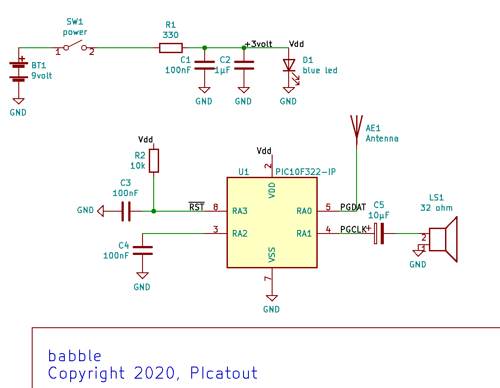

# babbillage

 Projet de sculpture électronique intitulé **babillage**. Ce petit circuit basé sur un microcontrôlleur **PIC10F322** produit une succession rapide de tonalités lorsque l'antenne capte un champ
 électromagnétique sufisamment puissant pour faire commuter l'entrée **RA0** du  MCU. L'entrée est laissée flottante pour la rendre plus sensible aux interférences. Le babillage dure environ 3 secondes. 

## schématique

## Principe de fonctionnement.

Le circuit est alimenté par une pile de 9 volts mais puisque le MCU tolère au plus 5,5volts il est alimenté au niveau de l'anode de la LED bleue **D1** qui est à 3 volts. 
Donc en plus de servir d'indicateur d'alimentation **D1** sert de régulateur de tenstion pour le **PIC10F322** et ça fonctionne très bien car le MCU consomme très peut de courant. 

### génération tonalités audios.

2 fréquences de 125Khz avec un rapport cyclique de 50% sont générées. La première est générée par le **PWM1 canal 1** et la deuxième par le **NCO**. 
La sortie des 2 générateurs est envoyé vers la **CLC** qui est configurée en **OU EXCLUSIF**. L'utilisation d'un **OU EXCLUSIF** sur ces signaux a 
pour effet de moduler le rapport cyclique selon la différence de fréquence entre les 2 signaux selon une progression triangulaire. 
Si on applique un filtre passe-bas sur la sortie on obtient une onde triangulaire de fréquence = Fnco-Fpwm.  Puisque les 2 fréquences utilisées sont dans les radio-fréquences, 
soit environ 125Khz on peut se passer du filtre passe-bas et connecter directement à travers un condenstateur au haut-parleur. 

La fréquence du **NCO** est modifiée de manière aléatoire pour produire une succession rapide de fréquences audio par battement avec la fréquence du PWM, 
d'où le nom de **babillage** car la succession rapide de fréquences en est, du moins métaphoriquement .

### générateur aléatoire.

Comme générateur aléatoire, le circuit utilise la mesure du temps de charge du condensateur **C4** branché sur **RA2**. La chare du condensateur se fait à travers
la résistance *pullup* de l'entrée **RA2**. Le cycle est le suivant. **RA2** en configurée en entrée avec pullup ce qui permet de charger **C2** vers **Vdd**. 
Le **TIMER0** est initialisée au début du cycle. Une lecture répéritive de l'entrée **RA2** est effectuée jusqu'à ce que la lecture arrive à **1**. 
À ce moment ont configure **RA2** en mode sortie à **0** volt pour décharger **C4** afin qu'il soit prèt pour le prochain cycle. 
Pendant la charge de **C4** vers **Vdd** le **TIMER0** incrémente. À la fin du cycle de charge la lecture du registre **TMR0** est utilisée 
pour modifier la valeur de l'incrément du **NCO**. Les paramètres sont choisient pour que la différence de fréquence entre les générateurs **PWM1_CH1** et **NCO** 
demeure dans l'intervalle des fréquences audibles.

Avec un condensateur de **47nF** pour **C4** il y a suffisamment de variabilitée entre les lectures pour produire l'effet aléatoire désiré. Le conddensateur met environ 1 milliseconde
pour se charger à un niveau suffisant pour faire basculer l'entrée **RA2** à **1**.

## photos
Voici des photos de la sculpture complétée.

## vidéo sur youtube

[vidéo](https://www.youtube.com/watch?v=wxc7ERc2EIc)

